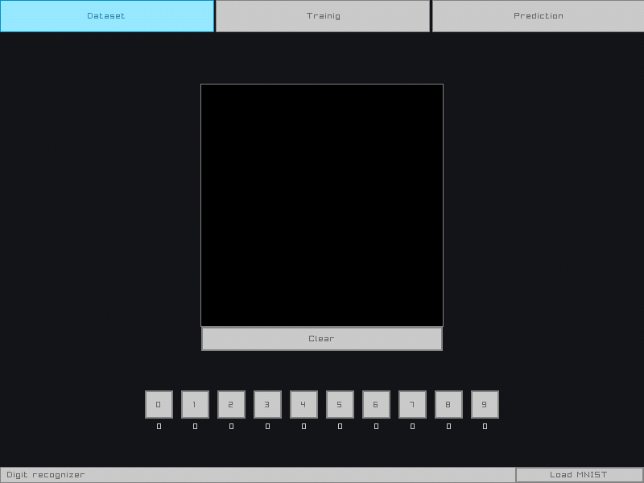
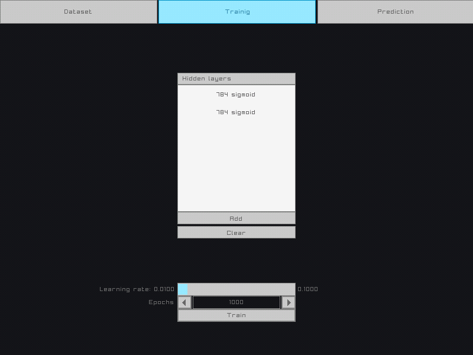
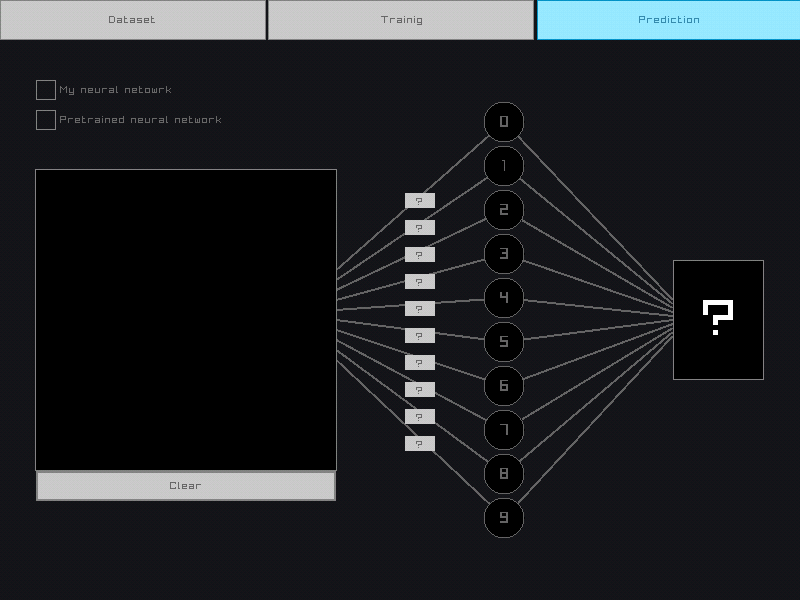

# Digit recognizer
This project is a kind of sandbox with a neural network for recognizing handwritten digits.
The goal of this project is to learn how to make neural networks from scratch (using C99), which is what I'm working on.

At the moment I have already implemented all the main components:
- Library for working with matrices
- Library for working with a neural network
- Graphical interface as a sandbox

Now I want to try to speed up the learning process,
as well as improve the accuracy of digit recognition (it's not very good right now).

## Program description

The program consists of several tabs describing the relevant stages of working with the neural network, which will be described below:

### Dataset
This tab is responsible for the dataset that will be used to train your model.
There is a field for drawing and buttons with digits, with which you have to correlate your drawn digits.
In addition, it is possible to load the MNIST dataset.

    

### Training
This tab is responsible for training your model on your dataset.
Here you can remove and add hidden layers to your neural network, as well as change the size and activation function of each hidden layer.
Before you start training your model, you will have the opportunity to choose the learning rate and the number of epochs.

    

### Prediction
Here you can test your own model, as well as play with the neural network I have pre-trained.

    

## Dependencies
To write this project, I used raylib, raygui, utest and pthread to create a thread on Unix-like systems and WinAPI on Windows.
All dependencies are built into the project, except raylib, which should be downloaded and builded automatically using CMake.
That is, you don't need to download or build something separately;)

## Build and run
Clone the project.

~~~bash  
  git clone https://github.com/Akimpaus/digit_recognizer.git
~~~

Go to the project directory.

~~~bash  
  cd digit_recognizer
~~~

Build the project.

~~~bash
mkdir build && cd build
cmake ..
~~~

Next, you need to compile and run the project.
The method may differ from platform to platform, but if you use Windows and VisualStudio, then you need to find the .sln file and run it, if you have a Unix-like system, then you will have enough to do:

~~~bash
make
~~~

- If you want to run the gui sandbox.
~~~ bash
cd digit_recognizer
./digit_recognizer
~~~

- If you want to run the tests.
~~~ bash
cd tests
./digit_recognizer_tests
~~~